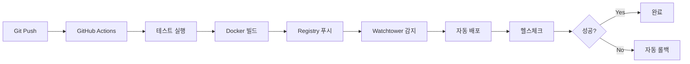

# CI/CD Pipeline 개선 가이드

## 🚀 개요

SafeWork Pro의 CI/CD 파이프라인이 다음과 같이 개선되었습니다:

- **GitHub Actions** 기반 자동화
- **Watchtower**를 통한 자동 배포
- **Multi-stage** 빌드 및 캐싱
- **헬스체크** 및 자동 롤백
- **KST 타임스탬프** 지원

## 📋 주요 개선사항

### 1. GitHub Actions Workflow

#### `deploy.yml` - 프로덕션 배포
- **Build & Test**: 프론트엔드 빌드 + 백엔드 테스트
- **Docker Build**: Multi-platform 빌드 (amd64, arm64)
- **Registry Push**: registry.jclee.me로 자동 푸시
- **Deploy**: SSH를 통한 직접 배포 또는 Watchtower 자동 감지

### 2. Watchtower 자동 배포

```bash
# Watchtower 설정
docker-compose -f docker-compose.watchtower.yml up -d

# 동작 방식
1. GitHub Actions가 새 이미지를 registry.jclee.me에 푸시
2. Watchtower가 30초마다 레지스트리 확인
3. 새 이미지 감지 시 자동으로 롤링 업데이트
4. 헬스체크 실패 시 자동 롤백
```

### 3. 필요한 GitHub Secrets

```yaml
# Docker Hub (기본 이미지용)
DOCKERHUB_USERNAME: qws941
DOCKERHUB_TOKEN: <Docker Hub Access Token>

# Private Registry
REGISTRY_USERNAME: qws941
REGISTRY_PASSWORD: bingogo1l7!

# SSH 배포
SSH_PRIVATE_KEY: <서버 접속용 SSH 키>
DEPLOY_HOST: 192.168.50.215
DEPLOY_PORT: 1111
DEPLOY_USER: docker

# Watchtower API (선택사항)
WATCHTOWER_API_TOKEN: <보안 토큰>
```

## 🔧 설정 방법

### 1. GitHub Secrets 설정

```bash
# GitHub CLI 사용
gh secret set DOCKERHUB_USERNAME -b "qws941"
gh secret set DOCKERHUB_TOKEN -b "<your-docker-hub-token>"
gh secret set REGISTRY_USERNAME -b "qws941"
gh secret set REGISTRY_PASSWORD -b "bingogo1l7!"
gh secret set SSH_PRIVATE_KEY < ~/.ssh/deploy_key
```

### 2. 서버에 Watchtower 설치

```bash
# SSH로 서버 접속
ssh -p 1111 docker@192.168.50.215

# Docker 레지스트리 인증 설정
docker login registry.jclee.me -u qws941 -p bingogo1l7!

# Watchtower 배포
cd ~/app/health
docker-compose -f docker-compose.watchtower.yml up -d
```

### 3. 애플리케이션 라벨 설정

`docker-compose.yml`에 Watchtower 라벨 추가:

```yaml
services:
  health-app:
    labels:
      - "com.centurylinklabs.watchtower.enable=true"
      - "com.centurylinklabs.watchtower.stop-signal=SIGTERM"
      - "com.centurylinklabs.watchtower.timeout=30s"
```

## 📊 배포 프로세스

### 자동 배포 (main 브랜치)



### 수동 배포

```bash
# GitHub Actions UI에서 수동 실행
1. Actions 탭 → Deploy workflow
2. Run workflow 클릭
3. Environment 선택 (production/staging)
4. Run workflow 실행
```

## 🔍 모니터링

### Watchtower 로그 확인

```bash
# 실시간 로그
docker logs -f watchtower

# 최근 배포 확인
docker logs watchtower | grep "Updated"
```

### 헬스체크 상태

```bash
# 로컬
curl http://localhost:3001/health

# 원격
curl http://192.168.50.215:3001/health
```

### 배포 이력

```bash
# 이미지 버전 확인
docker images | grep health-management-system

# 컨테이너 정보
docker inspect health-management-system | jq '.[] | {Version: .Config.Labels."org.opencontainers.image.version", BuildTime: .Config.Labels."org.opencontainers.image.created"}'
```

## 🚨 롤백 방법

### 자동 롤백
- 헬스체크 실패 시 자동으로 이전 버전으로 롤백

### 수동 롤백

```bash
# 이전 버전으로 태그 변경
docker tag registry.jclee.me/health-management-system:rollback registry.jclee.me/health-management-system:latest

# 재시작
docker-compose up -d --force-recreate
```

## 📈 성능 최적화

### 빌드 캐싱
- Docker 레이어 캐싱
- GitHub Actions 캐싱
- Registry 캐싱 (buildcache 태그)

### 병렬 처리
- 프론트엔드/백엔드 동시 빌드
- Multi-platform 동시 빌드
- 테스트 병렬 실행

## 🔐 보안

### 이미지 스캔
- Trivy 보안 스캔 (CI에서 자동 실행)
- 취약점 자동 리포트

### Secret 관리
- GitHub Secrets 사용
- 환경 변수로 전달
- 로그에서 자동 마스킹

## 📝 트러블슈팅

### Watchtower가 이미지를 못 찾는 경우

```bash
# 레지스트리 인증 확인
docker login registry.jclee.me

# config.json 확인
cat ~/.docker/config.json
```

### 배포 실패 시

```bash
# 컨테이너 로그 확인
docker logs health-management-system

# Watchtower 로그 확인
docker logs watchtower

# 수동 재시작
docker-compose restart health-app
```

### 헬스체크 실패

```bash
# 상세 로그 확인
docker-compose logs --tail=100 health-app

# 데이터베이스 연결 확인
docker exec health-postgres pg_isready

# Redis 연결 확인
docker exec health-redis redis-cli ping
```

---

## 🎯 다음 단계

1. **알림 설정**: Slack/Discord 웹훅 추가
2. **메트릭 수집**: Prometheus/Grafana 통합
3. **백업 자동화**: 데이터베이스 백업 스케줄링
4. **Blue-Green 배포**: 무중단 배포 구현