# 🚀 CI/CD 현재 상태

## 📊 파이프라인 상태

[](https://github.com/qws941/health-management-system/actions/workflows/ci.yml)
[](https://github.com/qws941/health-management-system/actions/workflows/deploy.yml)

## 🔄 자동 배포 프로세스

```mermaid
graph LR
    A[코드 Push] --> B[GitHub Actions 시작]
    B --> C[테스트 실행]
    C --> D[Docker 빌드]
    D --> E[Registry 푸시]
    E --> F[Watchtower 감지]
    F --> G[자동 배포 완료]
```



## ⏱️ 배포 시간

- **빌드 & 테스트**: ~2-3분
- **이미지 푸시**: ~30초
- **Watchtower 감지**: ~30초
- **총 소요 시간**: ~3-4분

## 📍 현재 설정

### GitHub Actions
- ✅ CI 파이프라인 (`ci.yml`)
- ✅ 배포 파이프라인 (`deploy.yml`)
- ✅ 간소화 배포 (`deploy-simple.yml`)

### Docker Registry
- **URL**: registry.jclee.me
- **이미지**: health-management-system
- **태그**: latest, SHA, version

### Watchtower
- **폴링 간격**: 30초
- **자동 업데이트**: 활성화
- **롤링 재시작**: 활성화

## 🔍 모니터링 링크

- [GitHub Actions](https://github.com/qws941/health-management-system/actions)
- [프로덕션 서버](http://192.168.50.215:3001)
- [헬스체크](http://192.168.50.215:3001/health)
- [API 문서](http://192.168.50.215:3001/api/docs)

## 📝 최근 배포

- **Commit**: b564bd0
- **메시지**: ci: 🚀 Watchtower 자동 배포 CI/CD 개선
- **시간**: 방금 전
- **상태**: 🟢 진행 중

## 🛠️ 문제 해결

### 배포가 안 될 때
1. GitHub Actions 확인
2. Watchtower 로그 확인
3. 컨테이너 상태 확인

### 롤백이 필요할 때
```bash
docker tag registry.jclee.me/health-management-system:이전SHA \
           registry.jclee.me/health-management-system:latest
docker-compose up -d
```