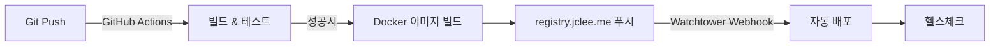

# SafeWork Pro 운영 배포 가이드

## 배포 개요

SafeWork Pro는 **All-in-One 컨테이너** 방식으로 운영 배포됩니다:
- 단일 Docker 컨테이너에 PostgreSQL + Redis + FastAPI + React 포함
- Watchtower를 통한 자동 배포
- registry.jclee.me 프라이빗 레지스트리 사용

## 빠른 배포

```bash
# 1. 자동 배포 스크립트 실행
./deploy-production.sh

# 2. 수동 배포
docker-compose -f docker-compose.production.yml up -d
```

## 배포 파일 설명

### `docker-compose.production.yml`
- **목적**: 운영 환경 Docker Compose 설정
- **특징**: 리소스 제한 없음, 호스트 자원 전체 활용
- **볼륨**: `/opt/safework/` 디렉터리에 영구 데이터 저장
- **포트**: 3001 (외부) → 8000 (내부)

### `.env.production`
- **목적**: 운영 환경 변수 설정
- **보안**: JWT 시크릿, DB 패스워드 등 포함
- **로케일**: 한국 시간대 및 UTF-8 설정

### `deploy-production.sh`
- **목적**: 자동 배포 스크립트
- **기능**: 디렉터리 생성, 이미지 풀, 헬스체크, 상태 확인
- **안전성**: 기존 컨테이너 정리 후 새 버전 배포

## 운영 환경 구조

```
/opt/safework/
├── data/
│   ├── postgres/     # PostgreSQL 데이터 (백업 필수)
│   ├── redis/        # Redis 캐시 데이터
│   └── uploads/      # 업로드 파일 (문서, 이미지)
├── logs/             # 시스템 로그
└── backup/           # 자동 백업 파일
```

## CI/CD 자동 배포 플로우



### 1. 개발자 액션
```bash
git add .
git commit -m "feat: 새 기능 추가"
git push origin main
```

### 2. GitHub Actions (자동)
- 테스트 실행
- Docker 이미지 빌드 
- registry.jclee.me에 푸시
- Watchtower 웹훅 트리거

### 3. Watchtower (자동)
- 새 이미지 감지
- 기존 컨테이너 중지
- 새 이미지로 컨테이너 재시작

## 배포 명령어

### 기본 배포
```bash
# 전체 자동 배포
./deploy-production.sh

# Docker Compose 직접 사용
docker-compose -f docker-compose.production.yml up -d
```

### 상태 확인
```bash
# 컨테이너 상태
docker ps | grep safework

# 헬스체크
curl http://192.168.50.215:3001/health

# 로그 확인
docker logs safework --tail=50

# 볼륨 확인
docker volume ls | grep safework
```

### 데이터 관리
```bash
# 데이터베이스 백업
docker exec safework pg_dump -U admin health_management > backup.sql

# 로그 로테이션
docker exec safework logrotate /etc/logrotate.conf

# 업로드 파일 백업
tar -czf uploads-backup.tar.gz /opt/safework/data/uploads/
```

## 트러블슈팅

### 컨테이너 시작 실패
```bash
# 로그 확인
docker logs safework

# 볼륨 권한 확인
ls -la /opt/safework/

# 포트 충돌 확인
netstat -tlnp | grep 3001
```

### 헬스체크 실패
```bash
# 내부 헬스체크
docker exec safework curl -f http://localhost:8000/health

# 데이터베이스 연결 확인
docker exec safework psql -U admin -d health_management -c "SELECT 1;"

# Redis 연결 확인
docker exec safework redis-cli ping
```

### 배포 롤백
```bash
# 이전 버전으로 롤백
docker pull registry.jclee.me/safework:previous
docker-compose -f docker-compose.production.yml down
docker-compose -f docker-compose.production.yml up -d
```

## 보안 설정

### 방화벽 규칙
```bash
# 3001 포트만 외부 접근 허용
sudo ufw allow 3001/tcp
sudo ufw deny 5432/tcp  # PostgreSQL 직접 접근 차단
sudo ufw deny 6379/tcp  # Redis 직접 접근 차단
```

### SSL/TLS (선택사항)
Nginx 리버스 프록시를 통한 HTTPS 설정 가능:
```nginx
server {
    listen 443 ssl;
    server_name safework.jclee.me;
    
    ssl_certificate /etc/ssl/certs/safework.crt;
    ssl_certificate_key /etc/ssl/private/safework.key;
    
    location / {
        proxy_pass http://192.168.50.215:3001;
        proxy_set_header Host $host;
        proxy_set_header X-Real-IP $remote_addr;
    }
}
```

## 모니터링

### 기본 메트릭
- **CPU/Memory**: Docker stats
- **디스크 사용량**: `/opt/safework/` 디렉터리 크기
- **응답 시간**: `/health` 엔드포인트 모니터링

### 알림 설정
Watchtower는 배포 성공/실패 시 웹훅을 통해 알림 가능:
```yaml
# docker-compose.yml
environment:
  WATCHTOWER_NOTIFICATION_URL: "https://hooks.slack.com/..."
```

## 백업 전략

### 자동 백업 (권장)
```bash
# crontab 설정
0 2 * * * /opt/safework/scripts/backup.sh

# backup.sh 내용
#!/bin/bash
DATE=$(date +%Y%m%d_%H%M%S)
docker exec safework pg_dump -U admin health_management > /opt/safework/backup/db_$DATE.sql
tar -czf /opt/safework/backup/uploads_$DATE.tar.gz /opt/safework/data/uploads/
```

### 수동 백업
```bash
# 전체 데이터 백업
docker-compose -f docker-compose.production.yml down
tar -czf safework-backup-$(date +%Y%m%d).tar.gz /opt/safework/data/
docker-compose -f docker-compose.production.yml up -d
```

---

**운영 URL**: http://192.168.50.215:3001  
**헬스체크**: http://192.168.50.215:3001/health  
**관리자**: SafeWork Pro Team