# 🚀 SafeWork Pro CI/CD 가이드

## 개요

운영 서버에 **Watchtower**가 이미 설치되어 있어, 매우 간단한 CI/CD 프로세스를 사용합니다.

## 🔄 자동 배포 프로세스

```mermaid
graph LR
    A[Git Push to main] --> B[GitHub Actions]
    B --> C[Frontend 빌드]
    C --> D[Docker 이미지 빌드]
    D --> E[registry.jclee.me 푸시]
    E --> F[Watchtower 감지]
    F --> G[자동 배포 완료!]
```



## 📋 필수 설정

### 1. GitHub Secrets 설정

```bash
# 레지스트리 인증 정보만 필요
REGISTRY_USERNAME: qws941
REGISTRY_PASSWORD: bingogo1l7!
```

### 2. docker-compose.yml 라벨 확인

```yaml
health-app:
  labels:
    - "com.centurylinklabs.watchtower.enable=true"
```

## 🎯 사용 방법

### 일반 배포 (권장)

```bash
# 1. 코드 수정
# 2. 커밋 및 푸시
git add .
git commit -m "feat: 새로운 기능 추가"
git push origin main

# 3. 끝! Watchtower가 자동으로 처리합니다
```

### 긴급 배포

```bash
# GitHub Actions 수동 실행
1. GitHub → Actions → "Simple Deploy with Watchtower"
2. Run workflow 클릭
```

## 📊 모니터링

### 배포 상태 확인 (운영 서버에서)

```bash
# Watchtower 로그 확인
docker logs watchtower --tail 50 | grep health-management-system

# 애플리케이션 상태
docker ps | grep health-management-system

# 헬스체크
curl http://localhost:3001/health
```

### 현재 버전 확인

```bash
docker inspect health-management-system \
  --format='{{index .Config.Labels "org.opencontainers.image.revision"}}'
```

## ⚡ 배포 시간

- GitHub Actions: ~2-3분 (빌드 + 푸시)
- Watchtower 감지: 30초 이내
- 총 배포 시간: **약 3-4분**

## 🚨 문제 해결

### Watchtower가 업데이트하지 않는 경우

```bash
# 1. 라벨 확인
docker inspect health-management-system | grep watchtower

# 2. 수동 업데이트 강제
docker pull registry.jclee.me/health-management-system:latest
docker-compose up -d

# 3. Watchtower 재시작
docker restart watchtower
```

### 롤백이 필요한 경우

```bash
# 이전 버전으로 태그
docker tag registry.jclee.me/health-management-system:이전SHA \
           registry.jclee.me/health-management-system:latest

# 재배포
docker-compose up -d
```

## 📝 주의사항

1. **main 브랜치에 푸시하면 자동 배포됩니다**
2. 테스트는 로컬에서 충분히 하세요
3. 중요한 변경사항은 PR을 통해 리뷰 후 머지

## 🎉 장점

- ✅ 완전 자동화
- ✅ 무중단 배포
- ✅ 간단한 설정
- ✅ 빠른 배포 (3-4분)
- ✅ 자동 헬스체크

---

**요약**: `git push` → 3-4분 후 자동 배포 완료! 🚀