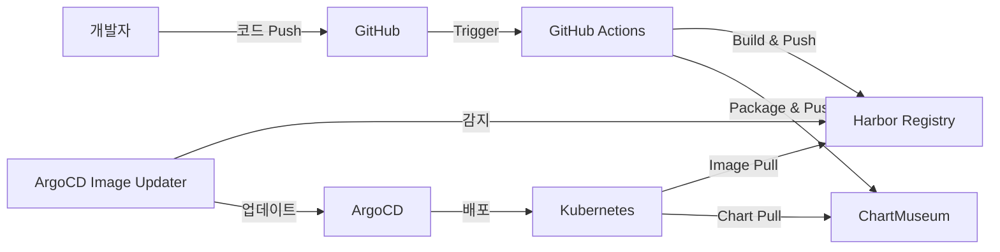

# SafeWork Pro K8s GitOps CI/CD 파이프라인 템플릿

> SafeWork Pro (건설업 보건관리 시스템)를 위한 완전 자동화된 Kubernetes GitOps CI/CD 파이프라인 템플릿

## 🎯 특징

### ✨ SafeWork Pro 최적화
- **All-in-One 컨테이너** 지원 (PostgreSQL + Redis + FastAPI + React)
- **한국어 환경** 완벽 지원 (Asia/Seoul, ko_KR.UTF-8)
- **기존 프로젝트 구조** 완벽 호환
- **데이터 보존** PVC 자동 설정

### 🔄 완전 자동화 파이프라인
- **GitHub Actions** 기반 CI/CD
- **ArgoCD Image Updater** 자동 배포
- **Harbor Registry** 컨테이너 이미지 관리
- **ChartMuseum** Helm 차트 저장소

### 🚀 원클릭 배포
```bash
# 단 한 번의 명령어로 전체 파이프라인 구성
./templates/quick-start.sh
```

## 📋 사전 요구사항

### 필수 도구
- Docker
- kubectl (Kubernetes 클러스터 접근)
- Helm 3.x
- GitHub CLI (gh)
- Git

### 인프라 환경
- **Container Registry**: registry.jclee.me (Harbor)
- **Chart Repository**: charts.jclee.me (ChartMuseum)  
- **GitOps Platform**: argo.jclee.me (ArgoCD)
- **Kubernetes 클러스터**: 접근 가능한 K8s 환경

## 🚀 빠른 시작

### 1. 템플릿 다운로드
```bash
# SafeWork Pro 프로젝트에서 실행
git clone <repository-url>
cd safework

# 또는 기존 프로젝트에 템플릿 추가
cp -r /path/to/template/templates .
```

### 2. 원클릭 설정
```bash
# 자동 설정 실행
./templates/quick-start.sh

# 또는 수동 설정
./templates/k8s-gitops-template.sh
```

### 3. 설정 검증
```bash
# 파이프라인 상태 확인
./validate-safework-gitops.sh

# GitHub Actions 워크플로우 확인
gh run list --limit 5
```

### 4. 배포
```bash
# 코드 변경 후 배포
git add .
git commit -m "feat: SafeWork 기능 추가"
git push origin main

# GitHub Actions → ArgoCD → Kubernetes 자동 배포 (2-3분)
```

## 🏗️ 아키텍처

### 전체 플로우


### SafeWork 컨테이너 구조
```
SafeWork All-in-One Container
├── PostgreSQL (내장 DB)
├── Redis (내장 캐시)
├── FastAPI (백엔드 API)
├── React (프론트엔드)
└── Nginx (웹 서버)
```

## 📁 생성되는 파일 구조

```
safework/
├── templates/                           # 템플릿 파일들
│   ├── k8s-gitops-template.sh          # 메인 설정 스크립트
│   ├── quick-start.sh                  # 빠른 시작 스크립트
│   └── README.md                       # 이 파일
├── .github/workflows/
│   └── deploy.yaml                     # GitHub Actions 워크플로우
├── charts/safework/                    # Helm 차트
│   ├── Chart.yaml                      # 차트 메타데이터
│   ├── values.yaml                     # 기본값 설정
│   └── templates/                      # K8s 매니페스트 템플릿
│       ├── deployment.yaml             # Deployment
│       ├── service.yaml                # Service (NodePort)
│       ├── configmap.yaml              # ConfigMap
│       ├── secret.yaml                 # Secret
│       ├── pvc.yaml                    # PersistentVolumeClaim
│       ├── hpa.yaml                    # HorizontalPodAutoscaler
│       ├── pdb.yaml                    # PodDisruptionBudget
│       ├── networkpolicy.yaml          # NetworkPolicy
│       └── _helpers.tpl                # Helm 헬퍼 함수
├── k8s/argocd/
│   └── safework-application.yaml       # ArgoCD Application
├── argocd-application.yaml             # ArgoCD Application (루트)
├── validate-safework-gitops.sh         # 검증 스크립트
└── SAFEWORK_GITOPS_GUIDE.md           # 상세 사용법 가이드
```

## ⚙️ 설정 옵션

### 환경 변수
```bash
# 기본값 (자동 감지)
export APP_NAME="safework"              # 앱 이름 (디렉토리명 자동 감지)
export NAMESPACE="safework"             # K8s 네임스페이스
export GITHUB_ORG="JCLEE94"            # GitHub 조직명
export NODEPORT="32301"                 # NodePort (자동 할당)

# 인프라 설정 (기본값 사용 권장)
export REGISTRY_URL="registry.jclee.me"
export CHARTMUSEUM_URL="https://charts.jclee.me"
export ARGOCD_URL="argo.jclee.me"
```

### 자동 할당 기능
- **NodePort**: 중복 검사 후 32301부터 자동 할당
- **네임스페이스**: 앱 이름과 동일하게 자동 설정
- **이미지 태그**: `prod-YYYYMMDD-SHA7` 형식 자동 생성
- **차트 버전**: `1.YYYYMMDD.BUILD_NUMBER` 형식 자동 생성

## 🔧 SafeWork 전용 최적화

### 컨테이너 설정
- **포트 구성**: 3001 (Nginx) → 8000 (FastAPI)
- **볼륨 마운트**: 데이터, 로그, 업로드 디렉토리
- **환경 변수**: 한국어 locale, 시간대 설정
- **프로브**: 시작 시간을 고려한 헬스체크

### 리소스 할당
```yaml
resources:
  limits:
    cpu: 2000m      # All-in-One 컨테이너 고려
    memory: 2Gi
    storage: 5Gi
  requests:
    cpu: 500m
    memory: 512Mi
    storage: 2Gi
```

### 데이터 보존
- **PVC**: 10Gi 자동 생성
- **마운트**: `/app/data` (데이터베이스 및 파일)
- **백업**: 스냅샷 스케줄링 지원

## 🔒 보안 설정

### 컨테이너 보안
- **최소 권한**: 필요한 권한만 부여
- **읽기 전용**: 가능한 영역은 읽기 전용 설정
- **Network Policy**: 네임스페이스 격리

### 인증 정보
```bash
# GitHub Secrets (자동 설정)
REGISTRY_USERNAME=admin
REGISTRY_PASSWORD=bingogo1
CHARTMUSEUM_USERNAME=admin
CHARTMUSEUM_PASSWORD=bingogo1

# Kubernetes Secret (자동 생성)
kubectl get secret harbor-registry -n safework
```

## 📊 모니터링

### 헬스체크 엔드포인트
- **Liveness**: `GET /health` (60초 대기)
- **Readiness**: `GET /health` (30초 대기)  
- **Startup**: `GET /health` (3분 대기)

### 접근 URL
- **서비스**: `http://NODE_IP:NODEPORT`
- **헬스체크**: `http://NODE_IP:NODEPORT/health`
- **API 문서**: `http://NODE_IP:NODEPORT/api/docs` (개발 환경)

### 모니터링 대시보드
- **ArgoCD**: https://argo.jclee.me/applications/safework
- **Harbor**: https://registry.jclee.me
- **Kubernetes**: kubectl 명령어 또는 대시보드

## 🔄 배포 프로세스

### 자동 배포 플로우
1. **코드 Push** → GitHub Actions 트리거
2. **테스트 실행** → 백엔드/프론트엔드 테스트
3. **이미지 빌드** → Harbor Registry 푸시  
4. **차트 패키징** → ChartMuseum 푸시
5. **ArgoCD 감지** → Image Updater 동작 (2-3분)
6. **자동 배포** → Kubernetes 리소스 업데이트

### 수동 조작
```bash
# 수동 동기화
argocd app sync safework --grpc-web

# 강제 업데이트
argocd app sync safework --force --grpc-web

# 롤백
argocd app rollback safework --grpc-web
```

## 🛠️ 트러블슈팅

### 일반적인 문제

#### 1. 이미지 Pull 실패
```bash
# Secret 재생성
kubectl delete secret harbor-registry -n safework
kubectl create secret docker-registry harbor-registry \
  --docker-server=registry.jclee.me \
  --docker-username=admin \
  --docker-password=bingogo1 \
  --namespace=safework
```

#### 2. Pod 시작 실패
```bash
# 로그 확인
kubectl logs -n safework -l app.kubernetes.io/name=safework --previous

# 이벤트 확인  
kubectl describe pods -n safework -l app.kubernetes.io/name=safework

# 리소스 확인
kubectl top pods -n safework
```

#### 3. 데이터 손실
```bash
# PVC 상태 확인
kubectl get pvc -n safework safework-data-pvc

# 백업에서 복원
kubectl apply -f backup/pvc-snapshot.yaml
```

### 검증 명령어
```bash
# 전체 상태 확인
./validate-safework-gitops.sh

# 개별 컴포넌트 확인
kubectl get all -n safework
argocd app get safework --grpc-web
curl http://NODE_IP:NODEPORT/health
```

## 📚 추가 문서

- **상세 가이드**: `SAFEWORK_GITOPS_GUIDE.md`
- **검증 스크립트**: `validate-safework-gitops.sh`
- **ArgoCD 설정**: `k8s/argocd/safework-application.yaml`
- **Helm 차트**: `charts/safework/`

## 🤝 기여하기

### 개선 사항 제안
1. Fork 프로젝트
2. 기능 브랜치 생성 (`git checkout -b feature/improvement`)
3. 변경사항 커밋 (`git commit -m 'feat: 새로운 기능 추가'`)
4. 브랜치 푸시 (`git push origin feature/improvement`)
5. Pull Request 생성

### 버그 리포트
GitHub Issues에 다음 정보와 함께 제출:
- SafeWork 버전
- Kubernetes 버전
- 에러 로그
- 재현 단계

## 📄 라이선스

MIT License - 자세한 내용은 [LICENSE](LICENSE) 파일 참조

## 🔗 관련 링크

- **SafeWork Pro**: https://safework.jclee.me
- **GitHub 저장소**: https://github.com/JCLEE94/safework
- **ArgoCD 대시보드**: https://argo.jclee.me
- **Harbor Registry**: https://registry.jclee.me
- **ChartMuseum**: https://charts.jclee.me

---

**버전**: 1.0.0  
**업데이트**: 2025-01-26  
**작성자**: SafeWork DevOps Team  
**지원**: admin@jclee.me